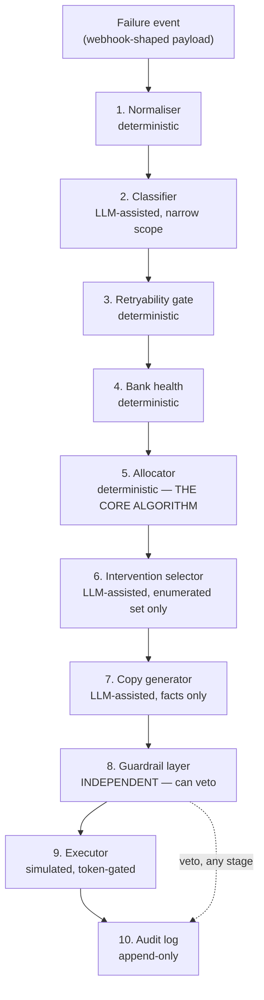

# ARCHITECTURE.md

## 1. One-sentence problem statement

A recovery engine for failed UPI AutoPay mandate executions that allocates
a hard-capped, regulator-constrained retry budget (1 attempt + 3 retries,
inside three disjoint daily windows) across those windows, chooses
out-of-band interventions between attempts, and proves — on a batch — how
much money it recovers and how many compliance violations it commits
(target, and measured result: zero).

## 2. Formal problem statement

**Given** a mandate `m` whose scheduled execution has failed, with:

- remaining retry budget `r ∈ {3, 2, 1, 0}` (of a total 1 + 3)
- a failure reason `f` from the closed 10-value Razorpay taxonomy, optionally
  tagged with an NPCI response code
- a failure source `s ∈ {customer, bank, gateway, network, razorpay}`
- payer bank identifier `b`, with a health signal `h(b, t)`
- mandate amount `a`, MCC, and billing-cycle position
- consent state, opt-out state, and last-contacted timestamp
- the customer's arrears (§2.4: returning to `active` never re-collects them)

**Choose**, for each remaining retry, an execution time `t` such that:

- `t` falls inside a permitted window (10:00 before / 13:00-17:00 / after
  21:30 IST)
- total attempts across the mandate's lifecycle never exceed 4
- `f` is not in the terminal set (`invalid_vpa`, or a Z8-tagged reason)
- the 24h pre-debit notification obligation is satisfiable before `t`,
  unless the MCC carve-out applies (FASTag `4784` / RuPay NCMC `7412`)
- inter-attempt out-of-band interventions respect consent and the
  contact-frequency budget

**Maximising** expected rupees recovered, using two UNVERIFIED, ablation-
tested heuristics as tie-breakers among already-legal candidates: a
salary-cycle-aware bias for `insufficient_funds` failures, and a
bank-health-aware penalty for candidates during known/likely downtime
(ASSUMPTIONS.md #A3, #A10).

**Subject to** zero compliance violations, as a hard constraint, not a
penalty term — a schedule that violates one is infeasible, not merely
worse (this is the single sentence that separates this project from "a
retry loop with extra steps").

**Stopping rule** — defined explicitly (`policy/stopping_rules.py`), not
implicit in running out of budget: stop when the verdict is
non-retryable, when the attempt budget is exhausted, or when
`UNVERIFIED_STOPPING_RULE_MAX_DAYS_SINCE_FIRST_FAILURE` (21 days,
ASSUMPTIONS.md #A4) has elapsed without success.

## 3. Pipeline

Maps directly onto `src/`:

| Stage | Module | LLM? |
|---|---|---|
| 1 Normaliser | `ingest/normaliser.py` | No |
| 2 Classifier | `classify/reason_classifier.py` (+ `llm_client.py`) | Optional, narrow |
| 3 Retryability gate | `policy/retryability.py` | No |
| 4 Bank health | `policy/bank_health.py` | No |
| 5 Allocator | `policy/allocator.py` | No |
| 6 Intervention selector | `intervene/selector.py` | Optional |
| 7 Copy generator | `intervene/copy_generator.py` | Optional |
| 8 Guardrail | `guardrails/validator.py`, `dark_pattern_screen.py`, `invariants.py` | **Never** |
| 9 Executor | `execute/simulator.py` | No |
| 10 Audit | `audit/log.py` | No |

`src/orchestrator.py` wires all ten stages together for the ENGINE strategy
only — see §6 below for why baselines deliberately don't reuse it.

## 4. Independence of the guardrail layer

This is the single most important structural property in the codebase, and
it is enforced two ways, not one:

**Statically** (`tests/test_no_llm_in_policy.py`): every file under
`src/policy/` and `src/guardrails/` is parsed with `ast` and checked for an
import of `anthropic`, `openai`, `src.classify`, or `src.intervene`. This
is INV-13, made mechanically unbreakable rather than a comment promising
it's true.

**Semantically**: `guardrails/validator.py` and `guardrails/invariants.py`
do not merely avoid importing the LLM-touching stages — they **re-derive
terminality from `regulatory_constants.py` independently**, deliberately
duplicating a few lines of logic that also exist in `policy/retryability.py`,
rather than importing that module's computed verdict. Two implementations
of the same small check, reading the same constants, is what makes "the
agent proposes, the platform disposes" (Build Spec §1 principle 4) true in
code, not just in the README. If `policy/retryability.py` ever had a bug,
the independent guardrail would not inherit it.

**Temporally**: the guardrail is invoked twice, not once — once by
`allocator.py`'s candidate generation implicitly (it only ever generates
legal candidates), and again by `guardrails/validator.py` at the literal
moment of execution/notification, re-checking CURRENT state (not state at
proposal time). This is what makes Failure Injection #8 (an opt-out
arriving between scheduling and execution) resolve correctly — see
`FAILURES.md` #8 and `DECISIONS.md` ADR-007.

## 5. Why this architecture, and not a single LLM call

Razorpay's own reference architecture for Bumblebee (their fraud-review
agent, Domain Context §1.3) is Planner → parallel Fetchers → Analyzers →
Decision, explicitly modelled on how their human risk team already worked:
specialists working in parallel, then comparing notes.

This project's shape is the sequential analogue for a DIFFERENT kind of
workflow — not "gather independent signals in parallel," but "narrow an
irreversible action through successive, independently-checkable gates,"
which is how a careful human payments engineer would actually reason
through one failed mandate: what happened → is it worth retrying → when's
the best time → what do we tell the customer → is any of that actually
legal → do it → prove we did.

**A single LLM call was rejected outright**, not as an afterthought: Build
Spec §0.1/§5.4 forbid an LLM from deciding legality, timing, amounts,
consent, or stopping — a single call collapsing "classify → schedule →
decide legality → execute" into one prompt would either violate that
constraint or require re-deriving the same deterministic logic inside a
prompt, which is neither auditable nor testable the way a Python function
with unit tests is.

## 6. Why baselines don't reuse the orchestrator (except B3, deliberately)

`eval/baselines.py` implements B0-B2 as their OWN, independent scheduling
logic — not because it was easier, but because a baseline's entire purpose
is to demonstrate what an undisciplined system does, including its
compliance violations. Routing B1 (deliberately non-compliant) through the
real guardrail layer would make it IMPOSSIBLE for it to violate anything,
which would silently erase the exact contrast this project exists to show.

B3 is the one exception, and deliberately so (DECISIONS.md ADR-008): Build
Spec Part 8 defines B3 as "reason-aware, not bank-aware," which is exactly
what the engine's own allocator produces with both ranking heuristics
turned off. Re-implementing that as a fourth, separate scheduler would risk
it silently drifting from the engine's real behaviour, defeating the point
of an ablation (it should differ from the engine in EXACTLY the two
heuristics, nothing structural).

## 7. The Stripe comparison (why this is a harder problem than the global benchmark)

| | Stripe Smart Retries (global cards) | This engine (UPI AutoPay, India) |
|---|---|---|
| Attempt budget | ~8 over 2 weeks | **4, hard cap** |
| Timing freedom | Any time | **3 daily windows only** |
| Card updater available | Yes (fixes 30-50% of hard declines) | No equivalent on UPI |
| Funds guaranteed at mandate setup | Yes (bank-managed) | No (UPI is stateless) |
| Over-retry consequence | Network penalties | API restrictions, onboarding embargo |

With roughly half the attempts and a fraction of the timing freedom, each
individual attempt has to be far better chosen. ML over billions of
transactions (Stripe's actual approach) is unavailable and would be
overkill for a four-slot allocation problem — constraint-aware allocation
with two narrow, ablation-tested heuristics is the right-sized tool for
this shape of problem, not a smaller version of Stripe's.

## 8. Track selection

This submission targets **Track 03 — AI Revenue Recovery**. The track's bar
("measured money recovered across a batch, compliant escalation, stopping
rules, audit trail... on ≥100 records") is met directly:
`EVALUATION.md` reports rupees recovered vs. at risk vs. leaked across 800
records (640 train / 160 held-out), an explicit stopping-rule trigger log,
an escalation log (mandates routed to human support, never auto-decided),
and a full audit trail per mandate (`src/cli.py explain`).

Tracks 01 (Growth & Agentic Commerce) and 04 (Finance Controller) were
considered and set aside: Track 01's bar overlaps heavily with what this
project already builds (bounded/gated actions, audit trail, a handled
failure) but its primary shape — growing merchant revenue via an AI buyer
flow — doesn't fit a recovery-scheduling problem as directly as Track 03
does. Track 04's bar (match rate + exception taxonomy on a reconciliation
problem) is a different domain entirely. Track 03 was the closest fit to
the actual problem this project set out to solve.

## 9. Rejected system-level alternatives

- **A vector DB / RAG layer.** Nothing in this problem requires retrieving
  from an unstructured corpus at decision time — every fact the deterministic
  core needs is a typed constant or a small reference CSV. Adding one would
  be exactly the "fashionable but unnecessary stack" Build Spec Part 13 and
  Razorpay's own hiring JD both warn against.
- **A multi-agent framework (LangGraph/CrewAI/etc.) for the whole pipeline.**
  The ten stages are a fixed, small, linear-with-one-loop pipeline, not a
  dynamic multi-agent negotiation. A framework's abstraction cost (another
  thing to explain in 90 seconds under §0.4's defensibility test) bought
  nothing a plain Python function call chain doesn't already do more
  legibly.
- **One shared "policy" module instead of separate retryability/bank_health/
  allocator/stopping_rules files.** Rejected for defensibility: Build Spec
  Part 5.3's directory layout separates these because each is independently
  testable and independently explainable — `tests/test_allocator.py` and
  `tests/test_retryability.py` can be read (and defended) without touching
  the other.

See `DECISIONS.md` for the ADR-numbered decisions referenced throughout the
codebase's own comments, and `ASSUMPTIONS.md` for every UNVERIFIED modelling
choice this architecture depends on.
