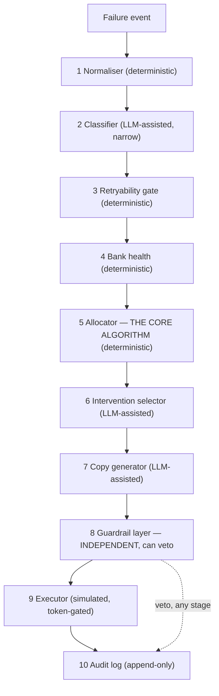

# UPI AutoPay Mandate Recovery Engine

**Merchants lose money every time a UPI AutoPay collection fails — not
because retrying is hard, but because retrying *correctly* is: NPCI caps
every mandate at 4 total attempts, confines them to 3 disjoint daily
windows, and treats some failure codes as permanently unretryable. Get
that wrong and you don't just lose the payment, you risk the merchant's
API access.**

## The headline number

> **Recovered Rs 79,17,547 of Rs 1,33,71,264 at risk across 640 training
> records (59.21%), with zero compliance violations** — vs. a naive
> always-retry baseline that recovers more raw rupees (Rs 97,02,832,
> 72.56%) by committing **4,211 compliance violations** to get there.
>
> On the 160-record held-out split (never tuned against): **Rs 16,04,900
> of Rs 29,93,428 at risk (53.61%), still zero violations.**

That second half of the headline is not a caveat, it's the point. Nine
other Buildathon submissions will report a recovery percentage. This one
reports the percentage **and** what it cost in compliance risk to get a
higher one — because Razorpay's own track bar for Revenue Recovery asks
for "compliant escalation, stopping rules, audit trail," not the highest
number achievable by ignoring all three. Full breakdown, per-invariant, in
[`EVALUATION.md`](EVALUATION.md) — regenerated by one command, not
hand-edited.

## 30-second quickstart

```powershell
python -m venv .venv
.\.venv\Scripts\Activate.ps1        # or: source .venv/bin/activate (macOS/Linux)
pip install -r requirements.txt
python -m data.generate --seed 42 --count 800
python -m eval.run_eval
python -m eval.scenarios
python -m pytest -q
```

No API key, no network access, and no `make` required for any of the above
— reproducible on a clean clone (`make setup && make eval && make demo`
also works if you have `make`; see `Makefile` and `LIMITATIONS.md`'s
environment note for why this project's own dev machine didn't).

Then look at one real record end-to-end:

```powershell
python -m src.cli list --limit 10
python -m src.cli explain <mandate_id>     # the full, plain-English decision trail for one mandate
python -m src.cli compare <mandate_id>     # every strategy (B0-B3, engine) on the SAME mandate, side by side
```

## Architecture



Ten stages, five of them touch an LLM optionally and five never do. The
five that decide anything about legality, timing, amounts, or consent are
100% deterministic — enforced not just by convention but by a test
(`tests/test_no_llm_in_policy.py`) that parses every file under
`src/policy/` and `src/guardrails/` and fails the build if any of them ever
import an LLM client. Full formal problem statement, the independence
argument for the guardrail layer, and every rejected system-level
alternative: [`ARCHITECTURE.md`](ARCHITECTURE.md).

## What makes this different from a retry loop

1. **The constraint set is the moat.** NPCI's 1-attempt-plus-3-retries cap,
   confined to three daily windows, corroborated by two independent sources
   fetched live during this build (`SOURCES.md` §1) and cross-checked
   against Razorpay's own subscription state machine, which independently
   halts after exactly 4 consecutive failures (`SOURCES.md` §4) — the same
   number, from two unrelated places.
2. **Intent inference — this project's signature feature.** Some customers
   deliberately keep an AutoPay-linked account near-empty as a de facto
   cancellation mechanism, because they don't trust the official cancel
   flow (documented on TechnoFino; see `docs/03-DOMAIN-CONTEXT.md` §3.2).
   Chasing those with retries isn't recovery, it's harassment of a customer
   who already said no. `src/policy/retryability.py` detects the pattern
   deterministically (3+ consecutive same-reason failures, near-empty
   balance — `ASSUMPTIONS.md` #A2) and routes to cancellation-confirmation
   instead of another attempt. Measured, not asserted: **81.8% precision,
   100% recall** on the held-out split (`EVALUATION.md`).
3. **The regulation postdates the product it's being compared to.**
   Razorpay's own Subscription Recovery agent shipped in Agent Studio on 12
   March 2026. The RBI's consolidated E-Mandate Framework landed 21 April
   2026. A recovery agent built before that date cannot structurally encode
   obligations that didn't exist yet — this one was built after, and
   encodes them as executable invariants, not prose.
4. **Zero compliance violations is measured, not assumed.**
   `src/guardrails/invariants.py` implements all 15 invariants from the
   build spec as independent, re-derived checks — never trusting an
   upstream stage's stored verdict — and `EVALUATION.md`'s violations table
   reports the count per invariant, per strategy, on the full batch. The
   engine's column is zero. The baselines' columns are not.

## Razorpay Agent Studio principles, implemented by name

| # | Principle | Where |
|---|---|---|
| 1 | Merchant always in control | Every action carries an audit entry with a stated reason (`audit/log.py`); `src/cli.py explain` is the review surface |
| 2 | No invented prices/discounts | The one goodwill lever (grace period) is drawn from a fixed 3-value merchant allowlist with a hard ceiling — never a free-form number (`INV-10`, `ASSUMPTIONS.md` #A7) |
| 3 | Verified first-party data only | Real NPCI bank identifiers, real MCC codes, real Razorpay error taxonomy (`SOURCES.md`) — no scraping, no external inference |
| 4 | Every action validated before execution | `guardrails/validator.py` re-checks legality independently, at the moment of execution, not only at schedule time (`ARCHITECTURE.md` §4) |
| 5 | Consent rules on customer communication | An opt-out halts the ENTIRE sequence, not just messages (`DECISIONS.md` ADR-007); re-checked at send/execute time, not schedule time (Failure Injection #8, `FAILURES.md`) |
| 6 | No false urgency / dark patterns | `guardrails/dark_pattern_screen.py` screens every generated notice against 6 named categories; rejections are logged and reported, not hidden |
| 7 | Transparent pricing/cost | `EVALUATION.md`'s LLM-cost section reads real call counts from `llm_client.get_usage_stats()` every run, always, even when it's Rs 0.00 |
| 8 | Certification & accountability | The full test suite + `eval/scenarios.py`'s 8 failure injections are re-run on every change, not measured once |
| 9 | Data privacy & compliance | No name/email/phone field exists anywhere in the data model (`entities.py`) — INV-12 holds structurally, not by a redaction step that could be forgotten |

## Track and repository map

Targets **Track 03 — AI Revenue Recovery** (rationale: `ARCHITECTURE.md` §8).

```
README.md            you are here
ARCHITECTURE.md       formal problem statement, diagram, rejected alternatives
EVALUATION.md         generated — every number, regenerate with `python -m eval.run_eval`
DECISIONS.md          ADR log, referenced by number from code comments
ASSUMPTIONS.md        every UNVERIFIED modelling choice, with sensitivity notes
SOURCES.md            every Tier A/B fact, its source, verification status
LIMITATIONS.md        what doesn't work, what's stubbed, what's out of scope
FAILURES.md           the 8 failure injections — checkable via `eval/scenarios.py`
AI_USAGE.md           which agent, how context was structured, 9 bugs it introduced and how they were caught
data/generate.py       seeded synthetic mandate book generator
eval/run_eval.py       one command, every EVALUATION.md number
eval/baselines.py      B0-B2 (B3 is the engine with its heuristics disabled — see DECISIONS.md ADR-008)
eval/scenarios.py      the 8 failure injections
src/domain/            entities, enums, regulatory constants (every one sourced)
src/policy/            deterministic core: retryability, bank health, allocator, stopping rules
src/guardrails/        independent validation layer — no LLM import, ever, enforced by a test
src/classify/          LLM-assisted classifier + the provider-optional client
src/intervene/         LLM-assisted intervention selector + copy generator + consent bookkeeping
src/execute/           the simulator (test-mode only — see Non-goals)
src/cli.py             minimal demo interface
tests/                 74 tests: invariants, no-LLM-in-policy, allocator, retryability, guardrails, generator
```

## Honest limitations

This section exists because Razorpay's own engineering culture (Domain
Context §1.3) rewards a volunteered weakness over a claimed absence of
one. Full list with detail: [`LIMITATIONS.md`](LIMITATIONS.md). The four
that matter most:

- **The RBI circular and Razorpay's Subscriptions API field shapes were
  not independently re-fetched this build session** — they rest on prior
  research, flagged as such rather than silently treated as re-verified
  (`SOURCES.md` §2, §7).
- **The outcome-success model is a calibration for demonstration, not an
  empirical figure** — no public dataset of real UPI AutoPay retry outcomes
  exists to calibrate against (`ASSUMPTIONS.md` #A8). Every recovery number
  in `EVALUATION.md` is a property of this simulation's stated assumptions.
- **The bank-health heuristic's measured lift is small on this batch**
  (`EVALUATION.md`'s ablation: 59.18% with it, 58.24% without) — reported
  honestly rather than inflated, and its demonstrative synthetic downtime
  pattern is explicitly labelled as such, not presented as realistic
  (`ASSUMPTIONS.md` #A10).
- **This is a simulation, not a live payment integration** (Build Spec
  §1.4's own non-goal) — test-mode logic only, no real payment credentials
  anywhere in this repository.

## Non-goals

Not a real payment integration. Not a fraud/risk system. Not a voice/
telephony agent. Not a general subscription-management platform. Not a
UI-first product — the interface exists only to make the batch legible
(`src/cli.py`, kept under the spec's 15%-of-effort budget for it).
